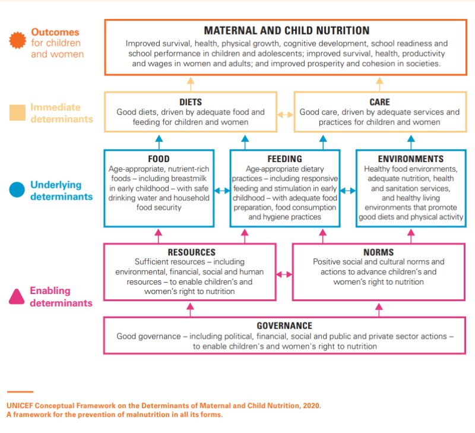

```{r setup, include=FALSE}
options(htmltools.dir.version = FALSE)

if(!require(remotes)) install.packages("remotes")
if(!require(fontawesome)) remotes::install_github("rstudio/fontawesome")
```

```{r xaringan-themer, include = FALSE}
library(xaringanthemer)
style_mono_light(
  base_color = "#002147",
  title_slide_background_image = "",
  title_slide_background_size = "cover",
  header_font_google = google_font("Fira Sans"),
  text_font_google   = google_font("Fira Sans Condensed"),
  code_font_google   = google_font("Fira Mono"),
  text_font_size = "1.2em",
  link_color = "#214700",
  header_h1_font_size = "50px",
  header_h2_font_size = "40px",
  header_h3_font_size = "30px",
  text_slide_number_font_size = "0.5em",
  footnote_font_size = "0.5em"
)
```

class: inverse, center, middle

# Tayo na sa talipapa

# Let's go to the market

---

background-image: url(https://upload.wikimedia.org/wikipedia/commons/thumb/b/b8/Street_Child%2C_Srimangal_Railway_Station.jpg/1024px-Street_Child%2C_Srimangal_Railway_Station.jpg)
background-size: cover
class: inverse

# "The biggest enemy of health in the developing world is poverty."

### Kofi Annan

???

Image credit: Md. Tanvirul Islam [GFDL (http://www.gnu.org/copyleft/fdl.html) or GFDL (http://www.gnu.org/copyleft/fdl.html)]

---

# Outline

1. Definitions

2. Theoretical frameworks

3. Case Studies

4. Summary

---

class: inverse, center, middle

# What is development?

---

# Points to consider about development

- Developed vs Underdeveloped

    - How is it determined?
    - Who determines?
    
- $\text{Developed} ~ = ~ \text{Wealthy?}$; $\text{Underdeveloped} ~ = ~ \text{Poor?}$

    - Measures of poverty - e.g., income, HDI, MPI

    
- Well-being

    - Measures of well-being
    - Can be related to health?

---

class: inverse, center, middle

# What is health?

---

# WHO definition of health

## "...a state of complete physical, mental and social well-being and not merely the absence of disease or infirmity."

- Healthy vs Unhealthy

    - Measures of health
    
- Well-being

    - can be related to development?

---

class: inverse, center, middle

# Development and Health

---

background-color: #ffffff

# NICE conceptual framework for public health

.center[]

---

background-color: #FFFFFF

# UNICEF conceptual framework of undernutrition

```{r unicef-framework, echo = FALSE, out.width = "78%", fig.align = "center"}

```

<!-- .center[] -->

---

background-color: #ffffff

# Conceptual pathways between agriculture and nutrition

.center[]

---

class: inverse, center, middle

# Case studies

---

background-image: url(https://odihpn.org/wp-content/uploads/2012/03/6c52631ec3d4cddfdab5a34581dd3c32-800x500.jpg)
background-size: contain
class: inverse

# Productive Safety Net Programme (PSNP) Ethiopia

---

# PSNP Ethiopia - overview

- Established in 2005; Currently is on its fifth phase of implementation

- Targeted between 7-8 million rural Ethiopians

- Aimed at enabling the rural poor facing chronic food insecurity to resist shocks, create assets and become food self-sufficient

- Major goals:

    - Support the rural transformation process;
    
    - Prevent long-term consequences of short-term food inaccessibility;
    
    - Encourage households to engage in production and investment; and
    
    - Promote market development by increasing household purchasing power.
    
---

# PSNP Ethiopia - mechanics

- Intervention is a combination of cash and food transfers based on season and need. Food given primarily in the lean season between June and August

- Vulnerable households receive six months of assistance annualy to protect them from acute food insecurity

- Transfers are predominantly conditional (85% of beneficiaries). Cash transfers provided after participation in productive activities such as rehabilitating land and water resources and developing community infrastructure, including rural road rehabilitation and building schools and clinics

- Unconditional direct cash transfers (about 15% of beneficiaries) for vulnerable households with limited labour capacity

- Recently (fourth round), unconditional direct cash transfers to households with pregnant women and/or with children under 2 years old

---

# PSNP Ethiopia - results of the first 2 phases

- Nutrition

    - No impact on nutrition (HAZ and stunting) of younger children in beneficiary households

    - No impact on nutrition between younger children (under 3 years) and older children (3 to 5 years)

    - No impact on nutrition between male and female children

- Food security

    - Positive impact on food security

---

# PSNP Ethiopia - reasons for impact results

- Irregular receipt of cash transfers

    - Tendency to save transfers in the form of livestock
    - At times of shock, households with irregular transfers are more likely to sell their livestock
    - Households with irregular transfers have much lower improvement in self-perceived welfare
    
- Receipt of lesser than actual amount of cash transfers

    - Beneficiaries expect 1200 Birr a month but some receive much less than this
    
- Limited productive opportunities on top of cash transfers

---

# PSNP Ethiopia - impact after four rounds

- No difference in household food security status, and in child diet diversity score

- But with increase in child meal frequency

- No effect on BMI z-score, stunting, underweight

---

# PSNP Ethiopia - reasons for impact results

- Social protection programmes in the form of cash transfers alone is not enough to reverse poor nutritional outcomes

- Nutrition-specific interventions will likely need to be bolstered/strengthened particularly with regard to **coverage** to potentiate the contribution of cash transfers

- Nutrition-sensitive programmes that impact on food systems will likely need to be given some attention as increased food consumption will require appropriate level of food quality to enable improved nutrition outcomes

---

background-image: url(https://www.alimentarium.org/sites/default/files/media/image/2017-03/Giorgio-Pesce-Atelier-Poisson_cover_food_fortification_01_0_0.jpg)
background-size: contain
class: top

# Large-scale food fortification programme in Rajasthan State, India

---

# Food fortification - overview

- Deliberately increasing the content of one or more essential micronutrients to commonly consumed foods (vehicle) so as to provide public health benefits

- Micronutrients are piggybacked on consumption of these foods on the basis (or the assumption) that these foods are commonly consumed

- Can be a highly cost-effective approach to reaching a large proportion of the population without needing to change behaviours

- Programme used to increase micronutrient intake in diet

---

# Food fortification - requirements

- Vehicle is universally or nearly universally consumed by the target population;

- Production, processing and distribution of vehicle is highly consolidated or centralised;

- Fortification addresses a specific identified micronutrient need in the target population

- Fortificant must be bioavailable, safe, and have favourable organoleptic properties

- Levels of fortification is informed by consumption patterns of the target population

- Political, financial and scientific consensus to sustain the programme

---

# Food fortification - Rajasthan context

- In 2010, Global Alliance for Improved Nutrition (GAIN) started voluntary fortification programme in Rajasthan

- Rajasthan has elevated prevalences of key nutritional indicators relative to national averages

- Rajasthan is involved in the Indian Universal Salt Iodization programme

- Rajasthan distributes atta wheat flour fortified with iron and folic acid through the public distribution system (PDS)

---

# Food fortification - results

- High consumption of atta flour vehicle but most of the population had no exposure to fortifiable atta wheat flour due to lack of consolidation or centralisation of production and processing of the vehicle

- Majority of fortifiable atta wheat flour is fortified (90%) but fewer than 1% are adequately fortified

- Atta flour fortification programme fails to reach at-risk population

- Oil vehicle is fortifiable but consumption of fortifiable oil is higher in households not at-risk compared to those at risk

---

background-image: url(https://journals.plos.org/plosone/article/figure/image?size=large&id=10.1371/journal.pone.0163176.g006)
background-size: contain

---

background-image: url(https://journals.plos.org/plosone/article/figure/image?size=large&id=10.1371/journal.pone.0163176.g007)
background-size: contain

---

background-image: url(https://www.opml.co.uk/files/Projects/Images/school-children-africa-banner.png)
background-size: cover
class: inverse

# Child Development Grant Programme (CDGP) in northern Nigeria

---

# CDGP Nigeria - overview

- Six-year programme in Jigawa State and Zamfara State, northern Nigeria that started in 2014

- Involves monthly, unconditional cash grant coupled with behaviour change communication (BCC) to address maternal education, healthcare facility access, household economic status, infant feeding, food consumption and women's empowerment

- Targets women from pregnancy until the child reaches two years old

---

# CDGP Nigeria - mechanics

- pregnant women at programme start/initiation were eligible/recruited

- pregnant women and their households were given 3500 naira monthly (increased to 4000 naira starting in 2017)

- some beneficiaries were exposed to **"low intensity"** BCC - messaging through posters, radio messages, text messages, health demonstrations/talks while some where exposed to **"high intensity"** BCC - mother support groups and one-on-one counselling in addition to the inputs for low intensity BCC.

---

# CDGP Nigeria - evaluation design

- household panel created through cluster randomised selection of beneficiaries and non-beneficiary villages

- within selected beneficiary and non-beneficiary villages, women were recruited into the study based on the following eligibility criteria:

    - pregnant at time of baseline survey; or,
    - married and of reproductive age at time of baseline survey
    
- recruited study participants were assessed at baseline, midline and endline points of the programme

---
 
# CDGP Nigeria - coverage and impact on child stunting

### "...successfully helped reduce stunting among children who were of an age range to be directly exposed by it."

- Programme coverage is high (90%; assessed as a separate study from the evaluation);

- Study had 22% attrition rate;

- 5.4% reduction in overall stunting

- 4.8% reduction in severe stunting

---

# CDGP Nigeria - infant and young child feeding and food security

- 75% exclusive breastfeeding prevalence among those enrolled in the programme compared to 47% among those not enrolled in the programme

- Food security improved based on reduced need of households in the programme to use coping mechanisms at times of food stress or crisis compared to those not in the programme

---

# Summary

- Links between development and health are a network of various cause and effects

- The types of interventions are determined by how development is defined and conceptualised

- Health is either a direct aim or goal (specific interventions) or an indirect or unstated objective (sensitive interventions)

- Coverage and the various factors that contribute or impede its attainment are critical factors that are more often than not implicitly assumed to be high

- Measurement of impact (i.e., effects of development interventions on health outcomes) would require more nuanced approaches that are able to account for complexity of the network of factors and interactions that contribute or impede success

---

class: inverse, center, middle

# Questions?

---

class: center, middle

# Thank you!

#### `r fontawesome::fa("envelope", fill = "#002147")` [ernest@guevarra.io](mailto:ernest@guevarra.io)  `r fontawesome::fa("globe", fill = "#002147")` [ernest.guevarra.io](https://ernest.guevarra.io)  `r fontawesome::fa("linkedin", fill = "#002147")` [ernestguevarra](https://linkedin.com/in/ernestguevarra)

<br/>

Slide deck can be accessed and viewed online at https://ernest.guevarra.io/devHealth

Slide deck in PDF format can be downloaded at https://ernest.guevarra.io/devHealth/devHealth.pdf

If you use R and R Markdown, you can clone a copy of the source code of this slide deck at https://github.com/ernestguevarra/devHealth
